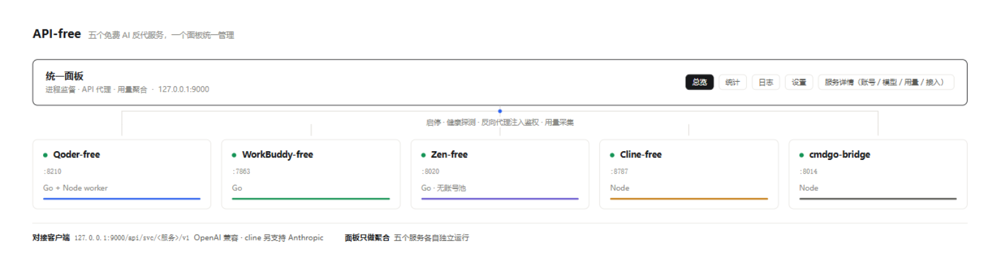
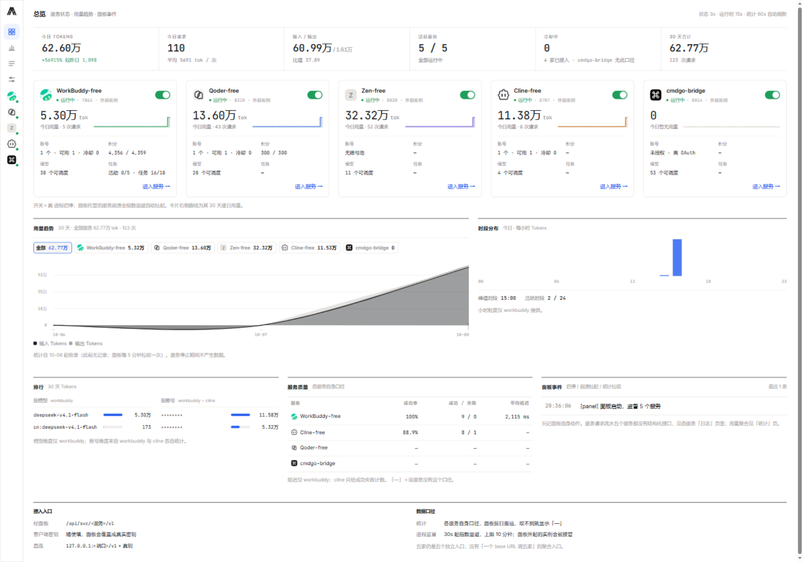
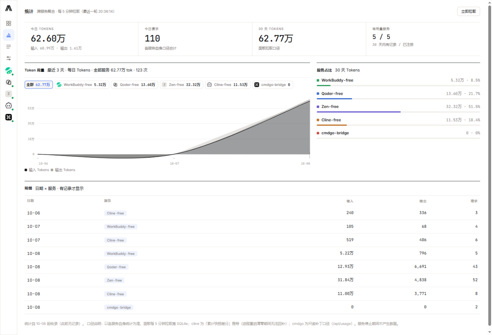
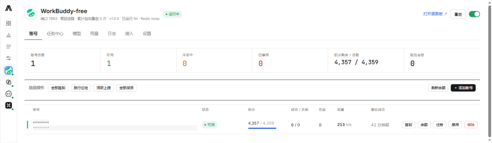
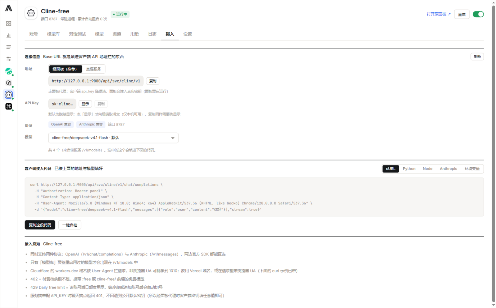
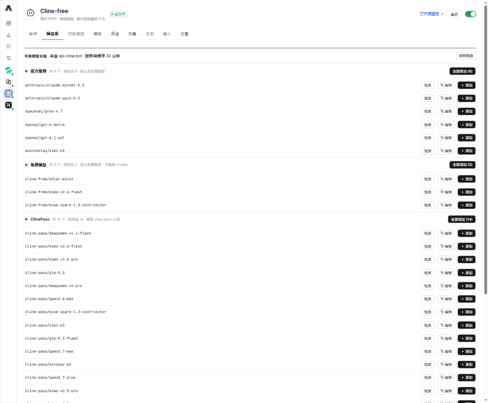
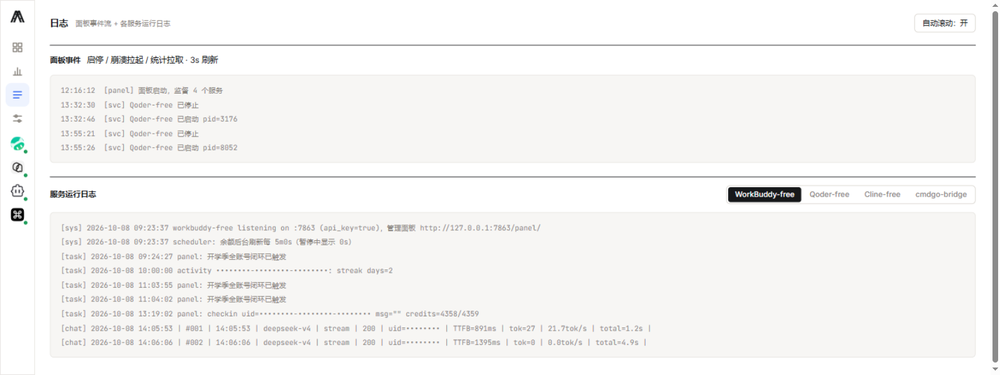
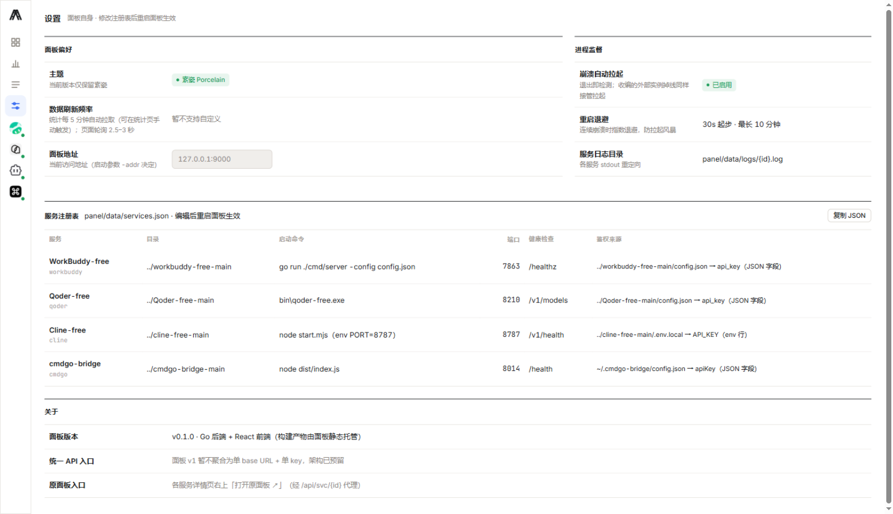

# API-free

[](panel/LICENSE)


把五个「免费额度」AI 反代服务收进一个面板统一管理。

Qoder、WorkBuddy、Cline、Command Code 各自都有一个本机反代项目，能把账号池变成 OpenAI 兼容 API；Zen-free 是把 OpenCode Zen 的匿名免费通道包成同样形状的服务（它没有账号，也不许要密钥）。但用起来是五套独立的进程、五个端口、五个风格不同的管理页面。**API-free 不改这些项目的功能，只在外面加一层统一面板**：一个界面看五个服务的状态、账号和用量，一处启停，一处拿密钥，一处接进各种客户端。



## 界面

总览：每个服务一张细线卡（状态 / 账号 / 积分 / 模型 / 今日用量 / 30 天迷你趋势，1920 宽下排成一行）、跨服务用量趋势、时段分布、模型与账号排行、服务质量、面板事件。



用量趋势的图例就是五个服务的 logo：片上带各自的 30 天 Tokens，点一下只看那一家（可多选），表头跟着换成该服务的输入 / 输出 / 请求数。合计时按**输入 / 输出分层**画，选中服务时每家一条线。

统计：同一张 Token 用量图（输入 / 输出分层 + 可点选图例），外加服务占比与逐日明细；按天落本地 SQLite。



服务页（每个服务一套页签：账号 / 模型 / 用量 / 日志 / 接入 / 设置；zen 没有账号池，页签里也就不摆「账号」）：



「接入」页签把地址、密钥、模型和可直接粘贴的调用代码放在一起，另有「一键自检」真发一条请求验证通路：



cline 的模型库（只有启用过的模型才会出现在 `/v1/models` 里）：



日志页：面板事件流 + 各服务运行日志，按服务自身能力如实呈现——没有日志接口的服务会写明原因，而不是显示空白。



设置页：服务注册表、进程监督参数，以及各服务的在线配置编辑（哪些字段需重启才生效会在保存时说明）。



## 它解决什么

| 痛点 | API-free 的做法 |
|---|---|
| 五套进程要手动一个个起 | 面板托管：一处启停，崩溃按 30s 指数退避自动拉起 |
| 五个端口、四套账号池要分别登录 | 统一面板里集中操作；登录流程（设备码 / OAuth）保持一致（zen 不需要登录） |
| 不知道一共花了多少、今天用了多少 | 面板按天聚合各服务用量，落本地 SQLite，跨服务对比 |
| 想接进客户端时要翻五个项目的文档找密钥 | 每个服务有「接入」页签：地址、密钥（默认脱敏）、五种调用代码、一键自检 |
| 五个服务的接口字段各不相同 | 面板统一读它们的原生接口，差异在服务端吸收掉 |

## 快速上手

需要 **Go 1.26+** 和 **Node 22+**。

```bash
git clone https://github.com/Patrick-mufeng/API-free.git
cd API-free

# 1) 三个配置从模板复制，填上你自己的密钥
cp workbuddy-free-main/config.example.json workbuddy-free-main/config.json
cp Qoder-free-main/config.example.json      Qoder-free-main/config.json
cp cline-free-main/.env.local.example       cline-free-main/.env.local

# 2) 构建面板（Go 后端 + React 前端）
cd panel
go build -o bin/panel.exe ./cmd/panel
cd ui && npm i && npm run build
cd ../..

# 3) 构建三个需要编译的服务
cd cmdgo-bridge-main && npm i && npm run build
cd ../Qoder-free-main && go build -o bin/qoder-free.exe ./cmd/server
cd ../zen-free-main   && go build -o bin/zen-free.exe   ./cmd/server
cd ..

# 4) 启动（必须在 panel/ 目录下启动，数据与日志路径是相对它的）
cd panel && bin/panel.exe
```

> 输出文件名不是随便取的：面板的注册表按 `bin\qoder-free.exe`、`bin\zen-free.exe` 查找这两个服务的可执行文件，路径对不上会启不来。
>
> cmdgo-bridge 不需要手动建配置，它第一次运行会在 `~/.cmdgo-bridge/config.json` 自动生成（含随机密钥）。
>
> zen-free 也不需要填密钥，它第一次运行会在自己目录下生成 `config.json`（含随机 api_key，只是本机鉴权用；上游凭据是公开的 `public`）。

Windows 上可以直接双击根目录的 `start.bat` / `stop.bat`（会依次拉起面板与五个服务，并轮询到就绪）。

启动后打开 **http://127.0.0.1:9000**。

> 面板启动时会自动收编已经在跑的服务，不需要先停掉它们。

## 五个服务

| 服务 | 端口 | 技术栈 | 说明 |
|---|---|---|---|
| Qoder-free | 8210 | Go + Node worker | Qoder 国内版 / 国际版，设备码授权 |
| WorkBuddy-free | 7863 | Go | 功能最多：账号池、签到、积分任务、用量统计 |
| Cline-free | 8787 | Node | 同时提供 OpenAI 与 Anthropic 两种协议；可选模型最多 |
| cmdgo-bridge | 8014 | Node | Command Code 反代，OAuth 登录 |
| Zen-free | 8020 | Go | OpenCode Zen 匿名免费通道：**没有账号**，只暴露上游判定为免费的模型 |

前四个是**独立项目**（其中三个由本仓库作者维护），API-free 只做聚合管理，不修改它们的代码。Zen-free 是本仓库的第五个服务（`zen-free-main/`），形状上与前四个一致，但口径不同：没有账号池、没有积分、免费额度按出口 IP 限流，用量记在自己目录下的账本里。它的上游形状只在一个文件里（`zen-free-main/internal/compat`），上游改动时改那里并跑 `bin/zen-free.exe -probe` 自检。

## 接入客户端

有两种入口，每个服务的「接入」页签里有现成的、可直接粘贴的代码：

- **经面板代理（推荐）** `http://127.0.0.1:9000/api/svc/<服务>/v1`
  面板会注入真实密钥，所以客户端的 API Key 随便填。适合不想把密钥散落在各处。
- **直连服务端口** `http://127.0.0.1:<端口>/v1` + 该服务的真实密钥。

支持 OpenAI 协议的全部客户端（Cline / Continue / Cursor / Cherry Studio / ChatBox…），cline 另支持 Anthropic 协议（`/v1/messages`，可接 Claude Code）。

详细步骤见 **[docs/接入指南.md](docs/接入指南.md)**。

## 面板功能

- **总览** — 每个服务一张细线卡（状态 / 账号 / 积分 / 模型 / 今日用量 + 30 天迷你趋势，1920 宽下一行排满）、用量趋势（图例点服务 logo 只看某家，输入 / 输出分层）、时段分布、模型与账号排行、服务质量、面板事件流。
- **服务页** — 每个服务一套页签：账号池、模型、用量、日志、接入、设置；workbuddy 另有任务中心，cline 另有模型库、对话测试、上游渠道，zen 没有账号池所以不摆账号页签。
- **统计** — Token 用量按日输入 / 输出分层，图例可点选服务；另有服务占比与逐日明细。按天落 SQLite（`modernc.org/sqlite`，纯 Go 无需 CGO）。
- **日志** — 面板事件流 + 各服务运行日志（按服务自身的接口能力如实呈现，没有的会说明原因而不是显示空白）。
- **设置** — 服务注册表、进程监督参数、各服务的在线配置编辑（标注哪些字段需要重启才生效）。

## 技术栈

- 面板后端：Go（`net/http` + `httputil`，路由用 Go 1.22+ 的 method pattern），SQLite 存统计
- 面板前端：React 18 + TypeScript + Vite，无 UI 框架、无 CSS 框架（手工 token 体系）
- 进程监督：自己实现（启停 / 端口探测 / 崩溃指数退避拉起 / 收编外部实例）

## 目录结构

```
API-free/
├── panel/                     统一面板
│   ├── cmd/panel/             Go 入口
│   ├── internal/
│   │   ├── supervisor/        进程监督（启停 / 拉起 / 收编 / 日志重定向）
│   │   ├── registry/          服务注册表（services.json）
│   │   ├── proxy/             反向代理（/api/svc/{id}/* 注入鉴权、资产路径改写）
│   │   ├── svcinfo/           一次采集产出服务卡与告警
│   │   ├── stats/             按天用量聚合（SQLite）
│   │   └── events/            面板事件环形缓冲
│   └── ui/                    React 前端（构建产物由面板静态托管）
├── Qoder-free-main/           五个被管理的服务（四个是独立上游项目，zen-free-main 在本仓库内）
├── workbuddy-free-main/
├── cline-free-main/
├── cmdgo-bridge-main/
├── zen-free-main/             OpenCode Zen 匿名免费通道（无账号池，上游形状集中在 internal/compat）
├── docs/                      接入指南 / 页面规划 / 计划方案
├── prototypes/                早期设计原型（保留作记录）
├── start.bat / stop.bat       Windows 一键启停
```

## 注意

- **密钥不入库。** 仓库只保留 `*.example` 模板，真实配置都在 `.gitignore` 里。首次克隆后按上面的步骤自己填。
- **不要暴露到公网。** 面板的代理会注入各服务的真实密钥；虽然读明文密钥的接口只对本机开放（非 loopback 返回 403），整站仍应只在可信网络内使用。
- 各服务有自己的上游服务条款，使用前请自行确认。
- **zen-free 尤其要看条款。** 它接的是 OpenCode Zen 的匿名免费通道，上游对该通道的说明是「free tier can only be used from within OpenCode」，把它接进第三方客户端处于灰区；上游还会随时调整准入规则（2026-09 就加过两道），届时需要按 `zen-free-main/README.md` 的「上游形状」一节跟着改。免费额度按出口 IP 限流，本项目不做多出口 / IP 池。

## 许可

本仓库的代码与文档以 [MIT](panel/LICENSE) 发布。

`Qoder-free-main/`、`workbuddy-free-main/`、`cline-free-main/`、`cmdgo-bridge-main/` 是各自独立的上游项目，随本仓库一并提供以便开箱可用。它们各自遵循其原始许可证（均为 MIT），版权与条款见各目录下的 `LICENSE` 文件。

`zen-free-main/` 是本仓库自己的服务，但它的请求形状移植自 [opencode2dsh](https://github.com/FishBottle7/opencode2dsh)（MIT © FishBottle7，其 Go 侧又是 [opencode2api](https://github.com/jasonxu114514/opencode2api) 的移植）——出处与移植范围逐项写在 `zen-free-main/README.md` 的「致谢与许可」一节。
